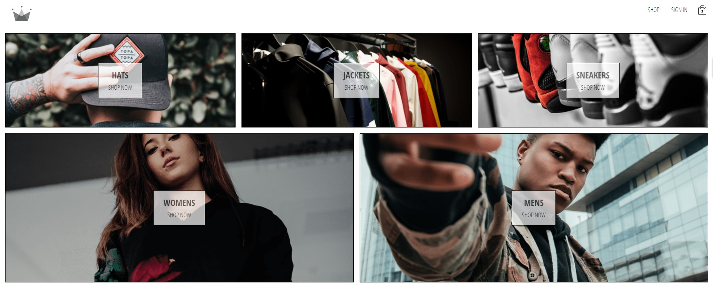

<!-- PROJECT SHIELDS -->
<!--
*** I'm using markdown "reference style" links for readability.
*** Reference links are enclosed in brackets [ ] instead of parentheses ( ).
*** See the bottom of this document for the declaration of the reference variables
*** https://www.markdownguide.org/basic-syntax/#reference-style-links
-->

<!-- PROJECT LOGO -->
 

    
 
<!-- TABLE OF CONTENTS -->
## Table of Contents

* [About the Project](#about-the-project)
  * [Built With](#built-with)
* [Getting Started](#getting-started)
  * [Installation](#installation)
* [Usage](#usage)
* [License](#license)

<!-- ABOUT THE PROJECT -->
## About The Project

  
 

 

  * The project is an e-commerce clone that was made with <b>react.js</b>, <b>redux</b> for global state management, <b>gooks</b> for local state, it has <b>BrowserRouter</b> for routing, has a <b>form</b> for signup and another one for signin, both are sending the information to <b>firebase</b>, also it has <b>sign-in-with-google</b> implemented using firebase, payment integration using <b>stripe</b>, it is using the <b>HOC pattern</b> for a spinner component, it was initialy using <b>Redux-Thunk</b> for asyncronous Redux but then it was replaced by <b>Redux-Saga</b>. The project is also a <b>progressive web ap</b>.
 
 * For performace it has <b>React Lazy + Suspense</b>, <b>memoization</b> , <b>useCallback</b> and <b>Gzipping</b> + <b>Compression</b>. 
 
 * For styling it has <b>CSS-in-JS</b> and <b>SCSS</b>.
 
 * There are some tests made with <b>Jest</b>
  
  

 

### Built With
* [Create React App](https://github.com/facebook/create-react-app)
* [ReactJs](https://reactjs.org/)
* [Redux](https://redux.js.org/)
* [CSS-in-JS](https://styled-components.com/)
* [Express](https://expressjs.com/)
* [Firebase](https://firebase.google.com/)

<!-- GETTING STARTED -->
## Getting Started

### Installation

To get a local copy up and running just clone with SSH/HTTPS.
Just note that this project was made using <b>yarn</b>!

<!-- USAGE EXAMPLES -->
## Usage

You can use this project for understanding the core principles of React-Redux using <b>good coding practices</b> and just seeing the architecture of a much more realistic project. It really is a lot more different than just building a counter or a to do app.

<!-- LICENSE -->
## License

Distributed under the ZMT License. 
